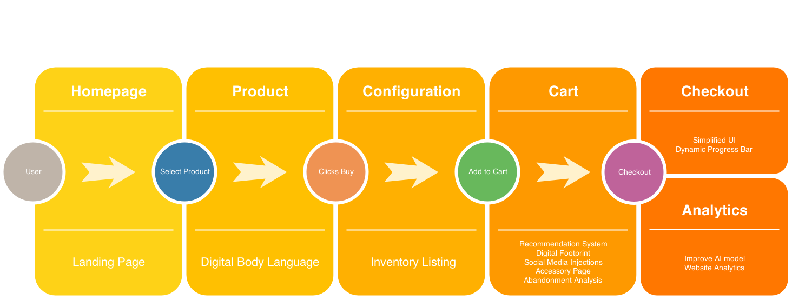

# AI-Enabled-Cart-Conversion

The project source code of the AI-Enabled-Cart-Conversion for the Hackathon conducted by Dell on 2019-Oct-21 to 2019-Oct-22.

## Singularity - AI-Enabled-Cart-Conversion

The participants are required to clone this repository and create a private Gitlab repository under their own username (Single repository per team). The following created sections in this README.md need to be duly filled, highlighting the denoted points for the solution/implementation. Please feel free to create further sub-sections in this markdown, the idea is to understand the gist of the components in a singular document.

### Project Overview
----------------------------------

A brief description of 
* Figure out the abandonment probabilty and implement solutions to reduce the abandonment.
* One Complete Reinforcement Learned Model that understands when to use which part of the solution

### Solution Description
----------------------------------

* Solutions :
    * Digital Body Language : Time spent on each section of the webpage, helps in determing abandonment rate.
    * Digital Footprint : User browsing patterns across multiple product pages.
    * Same Spec, Similar Price : Recommends similar spec and priced items to whats in the cart.
    * Social Valuation : Social Media and Tweets to motivate customer.
    * UI Uplifts : to make the buying process easier and reach the cart in fewer steps.

* Machine Learning Solution :
    * One Reinforcement Learning Model :
        * Determines the abandonment rate.
        * Uses the dataset to figure out which solution to implement based on user's digital body language.

#### Architecture Diagram

Flow Diagram

#### Technical Description

An overview of 
* Javascript, Django, Jquery, Python, ScikitLearn, Pandas.
* Steps:
    * `pip install -r requirements.txt`
    * `cd Application Code`
    * `python3 manage.py runserver`

### Team Members
----------------------------------

* Sudheendra Raghav - raghav170555@mechyd.ac.in
* Mohammed Abdul Khaliq - khaliq170568@mechyd.ac.in
* Rohan Russel Nedungadi - rohanrussel170544@mechyd.ac.in
* Rochan Avlur Venkat - rochan170543@mechyd.ac.in